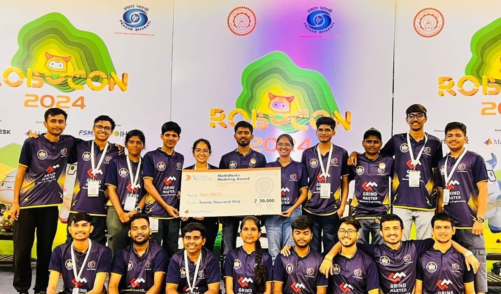

# From Code to Competition: My Journey with DD Robocon 2024's Fully Autonomous Robot

*How we built an AI-powered agricultural robot that secured AIR 5 and taught us invaluable lessons about robotics, teamwork, and perseverance*

---

## The Joy of Seeing Code Come Alive

As a programmer, there's no greater satisfaction than watching your lines of code transform into real-world action. In robotics, this joy is amplified tenfold — you witness your algorithms navigate physical challenges, make split-second decisions, and interact with the environment in ways that feel almost magical.

This was my experience during DD Robocon 2024, where I had the honor of programming **Robot-2**, a fully autonomous agricultural robot designed for the "Harvest Day" theme. What started as countless lines of code evolved into a sophisticated machine capable of differentiating between crops, navigating complex terrains, and making intelligent decisions — all without human intervention.

[](https://youtu.be/CjVqsJmcWDU?si=Ma6Y7uKGLJxJXgTu)
*Click to watch our robot demonstration*

## The Challenge: Simulating Agricultural Intelligence

The ABU Robocon 2024 theme, "Harvest Day," presented a fascinating challenge that perfectly bridged technology and agriculture. Our robot needed to simulate the intricate process of rice farming by:

1. **Autonomous Navigation** to designated agricultural areas
2. **Visual Recognition** to differentiate between paddy rice (blue or red balls) and empty grain (purple balls)
3. **Selective Collection** of only the valuable paddy rice
4. **Efficient Storage** in a designated silo system

What made this particularly challenging was the requirement for complete autonomy — no remote control, no human intervention, just pure algorithmic intelligence navigating real-world scenarios.

## Engineering Excellence: The Technical Architecture

### The Vision System: Eyes of Intelligence

The heart of our robot's intelligence lay in its dual **Pixy2 camera system** mounted on a sophisticated pan-tilt mechanism. This setup provided:

- **360-degree visual coverage** for comprehensive area scanning
- **Real-time object recognition** with millisecond response times
- **Color-based differentiation** between valuable crops and waste
- **Adaptive focus** to handle varying lighting conditions

### The Brain: Algorithmic Decision Making

Our codebase, organized into modular components, handled everything from low-level motor control to high-level strategic planning:

```
Robot_2/
├── Robot_2_Slave/          # Slave microcontroller coordination
├── Orientation_Shield/     # Spatial awareness and navigation
├── red_area/              # Red zone specific behaviors
├── blue_area/             # Blue zone specific behaviors
└── common_functions/      # Core algorithms
    ├── Pixy_function      # Computer vision processing
    ├── PID_Correct_functions # Precision control systems
    ├── Directions         # Pathfinding and navigation
    └── Silo              # Collection and storage logic
```

### The Movement: Precision in Motion

Implementing **PID control systems** was crucial for achieving the precision required in competitive robotics. Our robot needed to:

- Navigate narrow pathways without deviation
- Position itself accurately for collection
- Maintain stability during high-speed maneuvers
- Adapt to different surface conditions

## The Development Journey: Nights of Code and Days of Testing

### The Technical Challenges

Building an autonomous agricultural robot presented unique challenges that pushed both our technical skills and problem-solving abilities:

**Computer Vision Complexity**: Differentiating between similarly colored objects under varying lighting conditions required sophisticated image processing algorithms and extensive calibration.

**Real-time Decision Making**: The robot had to process visual information, plan its path, and execute movements simultaneously — all within tight time constraints.

**Hardware-Software Integration**: Coordinating multiple microcontrollers, sensors, and actuators required precise timing and robust communication protocols.

**Environmental Adaptability**: The robot needed to perform consistently across different venues, lighting conditions, and surface textures.

### The Learning Curve

Each challenge taught us valuable lessons:

- **Modular Programming**: Breaking complex behaviors into manageable, testable components
- **Robust Error Handling**: Preparing for unexpected scenarios and edge cases
- **Performance Optimization**: Balancing accuracy with speed for competitive advantage
- **Team Collaboration**: Coordinating between mechanical, electrical, and software teams

## Competition Performance: Excellence Under Pressure

Our dedication and technical prowess translated into remarkable achievements:

### 🏆 **Competition Results:**
- **Stage 1**: AIR 5 (All India Rank 5)
- **Stage 2**: AIR 5 
- **Stage 3 Finals**: AIR 6 in league stage
- **Quarterfinalists** in the national competition
- **MathWorks Modeling Award Winner**
- **Robotics Society Award Winner**

These rankings placed us among the elite teams in India, competing against the brightest engineering minds from premier institutions across the country.

## Beyond the Code: Lessons in Life and Leadership

While the technical achievements were significant, the most valuable lessons came from the journey itself:

### The Power of Perseverance

Robotics competitions are unforgiving. Hardware fails, algorithms behave unexpectedly, and time pressure is relentless. Despite our robot not performing as expected during some crucial moments, we learned that setbacks are stepping stones to greater understanding.

### The Art of Teamwork

Successful robotics requires seamless collaboration between diverse skill sets. Working with mechanical engineers taught me to think beyond algorithms and consider physical constraints. Collaborating with electrical engineers highlighted the importance of power management and signal integrity.

### Communication Under Pressure

Explaining complex technical concepts to team members, judges, and media taught me the invaluable skill of technical communication — breaking down sophisticated algorithms into understandable concepts.

## Technical Innovation: Open Source Contribution

Believing in the power of knowledge sharing, we've made our complete codebase available on GitHub:

**Repository**: [Robot-2_DD_Robocon](https://github.com/pratikwayal01/Robot-2_DD_Robocon)

### Key Libraries and Technologies:
- **[CytronMotorDriver](https://github.com/CytronTechnologies/CytronMotorDriver)**: Advanced motor control
- **[Pixy2](https://github.com/charmedlabs/pixy2)**: Computer vision processing
- **[LSA08](https://github.com/shashank3199/LSA08r)**: Line following sensors
- **Custom PID Controllers**: Precision movement algorithms

This open-source approach allows future teams to build upon our work, accelerating innovation in the robotics community.

## The Broader Impact: Technology Meets Agriculture

Our project represents more than just a competition entry — it's a glimpse into the future of agricultural automation. The technologies we developed have real-world applications:

- **Precision Agriculture**: Computer vision for crop health monitoring
- **Automated Harvesting**: Robotic systems for selective crop collection
- **Smart Farming**: AI-driven decision making in agricultural processes
- **Sustainable Practices**: Reducing waste through intelligent resource management

## Reflections: The Real Victory

While competition rankings are satisfying, the true victory lies in the transformation we experienced as engineers and individuals. The sleepless nights spent debugging code, the moments of breakthrough when complex algorithms finally worked, and the camaraderie built through shared challenges — these are the experiences that define us.

As I reflect on this journey, I'm reminded that in robotics, as in life, the destination is important, but the journey is what truly shapes us. Every line of code written, every problem solved, and every challenge overcome has contributed to our growth as engineers and innovators.

## Looking Forward: The Next Chapter

The skills, knowledge, and mindset developed during DD Robocon 2024 extend far beyond the competition arena. They form the foundation for future innovations in robotics, artificial intelligence, and automated systems.

For aspiring roboticists and programmers, my advice is simple: embrace the challenges, celebrate the small victories, and never underestimate the power of persistent learning. The field of robotics is vast and ever-evolving, offering endless opportunities for those willing to code their dreams into reality.

## Connect and Collaborate

The robotics community thrives on collaboration and knowledge sharing. If you're interested in robotics, computer vision, or autonomous systems, I'd love to connect and share experiences.

**Connect with me**: [LinkedIn - Pratik Wayal](https://www.linkedin.com/in/pratikwayal/)

**Explore the project**: [GitHub Repository](https://github.com/pratikwayal01/Robot-2_DD_Robocon)

---

*Here's to more milestones, more innovations, and more dreams coded into reality! 🚀🤖*

## References and Resources

- [DD Robocon India 2024](https://www.ddrobocon.in/)
- [ABU Robocon 2024 Official Site](https://aburobocon2024.vtv.gov.vn/)
- [Competition Game Video](https://www.ddrobocon.in/index.php/game-video)
- [Economic Times Coverage](https://m.economictimes.com/news/india/dd-robocon-2024-epic-showdown-of-indias-top-engineering-minds/articleshow/111748903.cms)
- [Times of India Coverage](https://timesofindia.indiatimes.com/city/delhi/students-from-india-compete-in-robocon-2024-for-the-ultimate-robotics-showdown/articleshow/111738699.cms)

---

*Originally published on Medium - sharing the journey of turning code into competitive robotics excellence.*